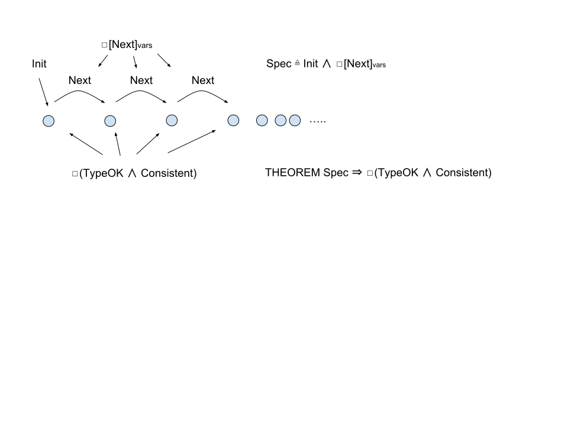
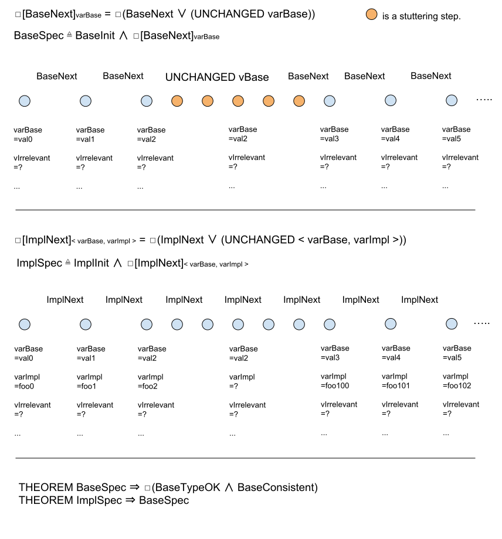
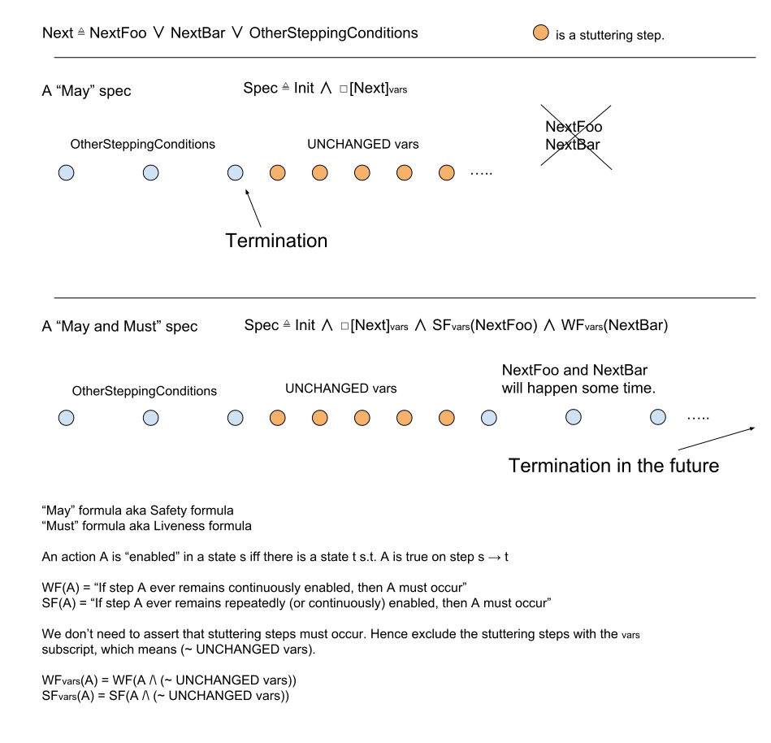

## TLA+

- Expresses temporal logic
- Cannot generate code
- Cannot verify written code
- Forces you to think in logic
- Is testable pseudocode with standardized syntax -- at least PlusCal is
- Can compare multiple logic for the same behavior/requirements, expressed at different levels of abstraction

---

## Logic

The universe is made of ∞ variables which can have ∞ values

A state assigns values to variables

There exist ∞ states

Behavior := ∞ sequence of states

There exist ∞ behaviors

Step := transition between 2 states

---

## Jug problem

Problem : Given unmarked jugs sized 3 and 5, derive a volume of 4

Goal : Express a behavior that transitions from an initial state to an end state

Steps to defining a behavior:

1. Choose a few variables that you care about, out of ∞ variables
1. For each variable, derive permissible values (across all states)
1. For each variable, decide on set of permissible initial values
1. Decide on permissible transitions of your variables (and ignore other ∞ variables)

| variables | values at states |
| --- | --- |
| small | 0, 3, 0, 3, 1, 1, 0, 3 (, 3, 3, 3, 3, ...) |
| big   | 0, 0, 3, 3, 5, 0, 1, 1 (, 1, 1, 1, 1, ...) |

The universe keeps going after our system terminates

---

```tla
------------------------- MODULE DieHardJugProblem -------------------------
EXTENDS Integers
VARIABLES small, big

TypeOK == /\ small \in 0..3
          /\ big   \in 0..5

----------------------------------------------------------------------------

Init == /\ small = 0
        /\ big = 0

FillSmall == /\ small' = 3
             /\ big' = big

FillBig == /\ small' = small
           /\ big' = 5

EmptySmall == /\ small' = 0
              /\ big' = big

EmptyBig == /\ small' = small
            /\ big' = 0

SmallToBig == IF small + big <= 5
                THEN /\ small' = 0
                     /\ big' = big + small
                ELSE /\ big' = 5
                     /\ small' = small + big - 5

BigToSmall == IF small + big <= 3
                THEN /\ small' = small + big
                     /\ big' = 0
                ELSE /\ small' = 3
                     /\ big' = small + big - 3

Next == FillSmall \/ FillBig \/ EmptySmall \/ EmptyBig \/ SmallToBig \/ BigToSmall

----------------------------------------------------------------------------

EventualCondition == small + big = 4

----------------------------------------------------------------------------

Spec == Init /\ [][Next]_<<small, big>> /\ WF_<<small, big>>(EventualCondition)

=============================================================================
```

---



---

All statements are math expressions, NOT instructions (procedural or declarative)

A formula is a boolean-valued math expression

`Init`, `TypeOK`, `Consistent` are formulas on one state

`Next` is a formula on one step

A temporal formula is a formula on any ∞ sequence of states, i.e. on any behavior

`Spec` is a temporal formula that evaluates to true for the ∞ behaviors that we care about

`Consistency` is the business constraint logic that we're trying to check, given a `Spec`

---

A spec is an expression that evaluates true/false on one behavior

A theorem asserts that an expression evaluates true on all possible ∞ behaviors

`THEOREM p => q` asserts "If p is true for a given behavior, then q is true for this behavior"

A theorem asserting some guarantee of a spec has the form `Spec => some_temporal_formula`

```
THEOREM Spec => [](TypeOK /\ Consistent)
```

```
THEOREM Spec1 => Spec2
```

The theorem asserts that the RHS of `=>` is an "invariant" of the LHS spec

---



E.g.

BaseSpec: We have two jugs, and we want to verify that a bunch of state transitions can implement some such behavior

ImplSpec: We have two jugs in separate data centers, and we want to verify that TCP over avian carriers can implement that behavior

---



---

## Sources & Links

Content and code were lifted out of https://lamport.azurewebsites.net/video/videos.html

In the context of real-world engineering team: http://www.cslab.pepperdine.edu/warford/math220/How-Amazon-Web-Services-Uses-Formal-Methods.pdf

Tutorials and non-toy examples: https://learntla.com and https://www.hillelwayne.com/post/list-of-tla-examples/
